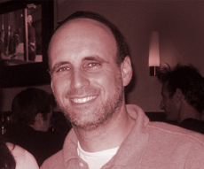

#Our Rabbi

[Rabbi Eliezer Hirsch](mailto:RabbiEHirsch@gmail.com) is Mekor Habracha's founding rabbi. Rabbi Hirsch received rabbinical ordination from Ner Israel Rabbinical College in Baltimore, Maryland and Yeshiva Ohr Reuven in Suffern, NY. He earned a Dual Bachelor's Degree in Talmudic Law and Accounting, and a Master's Degree in Talmudic Law from Ner Israel. He also completed post graduate studies in Advanced Rabbinics and Synagogue Management at Touro College and holds Torah U'mesorah teacher certification.

Rabbi Hirsch grew up in Kew Garden Hills, NY, attending Yeshiva of Central Queens elementary school and Yeshiva of Flatbush high school. An aspiring songwriter, musician and band leader, he ultimately altered his plans to spend nearly two decades studying at a number of diverse Yeshivot, including Yeshivat Hakotel, Ner Israel, Mir Jerusalem, Kollel Meshech Chochma, and Ohr Reuven. While in Yeshiva, he forged close relationships with prominent Rabbinic leaders and received years of training from renowned Halachic authorities.

In addition to leading Congregation Mekor Habracha, Rabbi Hirsch serves as Dean of Jewish philosophy for the Association of Hebraic Studies Institute, a distance learning college based in Monsey, NY. He has worked for a number of leading Jewish organizations, including Aish Hatorah Jerusalem, Yeshivat Hakotel, Great Neck Synagogue, Bruriah High School, The Etz Chaim Center, and Yeshiva Ohr Reuven.

Since he and his wife Miriam arrived in Philadelphia, the congregation has experienced exponential growth, and has significantly contributed to the flourishing Center City Jewish community, which now boasts an array of Jewish services, including [a fully functioning eruv](http://www.centercityeruv.org), a daily morning minyan in the Rittenhouse neighborhood, and [an assortment of kosher establishments](eat-out.html).

Rabbi Hirsch still enjoys playing and writing music when he can find the time. He plays keyboard for Mekor's own band, *Moments of Wrong*.